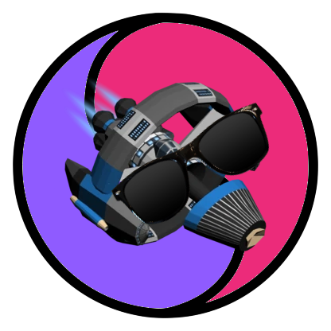

# Oddyserver

## What is Oddyserver?
Oddyserver is a moddable game server for the hit web game [Starblast.io](https://starblast.io/).

It is written in NodeJS and is designed to be easy to use and easy to modify.

It is currently in its infancy and is not ready for use.

## How do I use Oddyserver?
Oddyserver is not ready for non-developer use yet. If you are a developer, you can clone this repository and run `npm install` to install the dependencies. Then, you can run `npm start` to start the server.

## Configuration
The configuration file is located at `config.json`. It contains the following options:
- `PORT`: The port to run the server on.
- `HOST`: The ip address to bind the server to.
- `MODE`: "SECURE" or "UNSECURE". Determines whether the server uses https or http.
- `KEY`: The path to the ssl key file. (Only used if `MODE` is "SECURE")
- `CERT`: The path to the ssl certificate file. (Only used if `MODE` is "SECURE")

## To do list
- [X] Clients connect to the server
- [X] Players can see other players
- [1/2] Players can move around
- [1/4] Players can shoot
- [1/4] Players can upgrade their ship
- [ ] Players can collide with objects
- [ ] Players can mine asteroids
- [ ] Players can chat
- [ ] Server automatically detects the current join packet

## Authors

  
  

